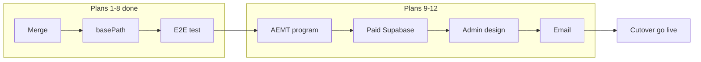

# Midwest EA — Vercel Migration Master Plan

Single Next.js app on Vercel: `/` marketing, `/checkout/*`, `/admin/*`, `/api/*`.

**Shell app:** `apps/webapp`  
**Webflow CMS sync:** dropped (Supabase is source of truth)

## Status tracker

| # | Phase | Status | Branch | Notes |
|---|-------|--------|--------|-------|
| 1 | [Merge into one Next.js app](migration/plan-01-merge.md) | `done` | | Merged midwestea-site into apps/webapp |
| 2 | [Remove `/app` basePath](migration/plan-02-basepath.md) | `done` | | basePath removed; legacy redirects in next.config |
| 3 | [Rename dashboard → admin](migration/plan-03-admin.md) | `done` | | `/admin/*` with legacy redirects |
| 4 | [Add purchase-confirmation/general](migration/plan-04-confirmation.md) | `done` | | Matches checkout success URL |
| 5 | [Strip debug + Cloudflare deps](migration/plan-05-cleanup.md) | `done` | | Debug/test routes removed; Webflow env untracked; midwestea-site retired |
| 6 | [Deploy Vercel staging](migration/plan-06-vercel.md) | `done` | | Staging live; smoke tests passed in browser |
| 7 | [Wire register buttons + gallery](migration/plan-07-supabase.md) | `done` | | Register buttons, course/program galleries, and pricing wired to Supabase; verified locally |
| 8 | [E2E checkout test](migration/plan-08-e2e.md) | `done` | `staging` | Core E2E passed Jun 2026; email moved to Plan 12 |
| 9 | [Add AEMT program + class](migration/plan-09-aemt.md) | `in_progress` | | Supabase + page wired; hero assets + checkout smoke test pending |
| 10 | [Migrate to paid Supabase](migration/plan-10-supabase-db.md) | `pending` | | New DB; verify Stripe + checkout still wired |
| 11 | [Admin panel design update](migration/plan-11-admin-design.md) | `pending` | | Designs TBD |
| 12 | [Email (Resend)](migration/plan-12-email.md) | `pending` | | Confirmation + invoice email; Kyle/account |
| 13 | [DNS cutover — go live](migration/plan-13-cutover.md) | `pending` | | Merge to `main`, DNS in Vercel, retire Webflow |

Status values: `pending` | `in_progress` | `done` | `blocked`

## Deferred to later plans

| Item | Plan |
|------|------|
| Supabase auth Site URL / redirect URLs (don’t break live Webflow until cutover) | 13 |
| Resend email env vars (confirmation + invoice) | 12 |
| Daily-log cron / `CRON_SECRET` (likely remove on paid DB) | 10 |
| Production DNS + Webflow decommission | 13 |

## Plan 8 E2E checklist (complete)

Completed on staging Jun 2026 (`BLS-001`, `PARA-002`, waitlist). See [`migration/plan-08-e2e.md`](migration/plan-08-e2e.md).

**Core:**

- [x] Course checkout completes on staging
- [x] Program checkout completes on staging
- [x] Success page renders (`/purchase-confirmation/general`)
- [x] Enrollment row created
- [x] Transaction row created
- [x] Admin shows new student + transaction
- [x] Waitlist submission works
- [x] Webhook signature validation passes
- [x] Failed payment does not create enrollment
- [x] Webhook idempotency (resend `checkout.session.completed`)

**Email (Plan 12):**

- [ ] Personal Resend account + `midwestea.com` DNS verified in Resend
- [ ] `RESEND_API_KEY` / `EMAIL_FROM` on Vercel; Supabase Auth SMTP configured
- [ ] Admin OTP + confirmation email sent
- [ ] Client Resend account + DNS/key rotation at cutover (Plan 13)

## How to use

1. Work one plan at a time; update status in this file after each phase.
2. Branch per plan: `migration/plan-09-aemt`, etc.
3. Do not start plan N+1 until plan N "Done criteria" in its detail doc are met.
4. **Plan 13 is last** — production cutover only after 9–12.

## Staging deploy

See [`docs/vercel-staging-setup.md`](../vercel-staging-setup.md).

## Production cutover

See [`docs/migration/plan-13-cutover.md`](migration/plan-13-cutover.md) and [`docs/migration/cutover-runbook.md`](migration/cutover-runbook.md).

## Architecture

