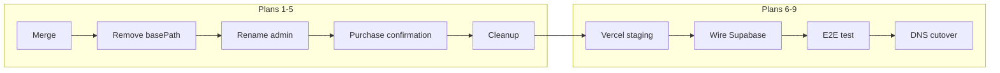

# Midwest EA — Vercel Migration Master Plan

Single Next.js app on Vercel: `/` marketing, `/checkout/*`, `/admin/*`, `/api/*`.

**Shell app:** `apps/webapp`  
**Webflow CMS sync:** dropped (Supabase is source of truth)

## Status tracker

| # | Phase | Status | Branch | Notes |
|---|-------|--------|--------|-------|
| 1 | [Merge into one Next.js app](migration/plan-01-merge.md) | `done` | | Merged midwestea-site into apps/webapp |
| 2 | [Remove `/app` basePath](migration/plan-02-basepath.md) | `done` | | basePath removed; legacy redirects in next.config |
| 3 | [Rename dashboard → admin](migration/plan-03-admin.md) | `done` | | `/admin/*` with legacy redirects |
| 4 | [Add purchase-confirmation/general](migration/plan-04-confirmation.md) | `done` | | Matches checkout success URL |
| 5 | [Strip debug + Cloudflare deps](migration/plan-05-cleanup.md) | `done` | | Debug/test routes removed; Webflow env untracked; midwestea-site retired |
| 6 | [Deploy Vercel staging](migration/plan-06-vercel.md) | `pending` | | vercel.json + cron route ready; deploy not done yet |
| 7 | [Wire register buttons + gallery](migration/plan-07-supabase.md) | `pending` | | MarketingPage scaffold; verify with Supabase data |
| 8 | [E2E checkout test](migration/plan-08-e2e.md) | `pending` | | Smoke script ready; staging tests not run |
| 9 | [DNS cutover](migration/plan-09-cutover.md) | `pending` | | [Cutover runbook](migration/cutover-runbook.md) only |

Status values: `pending` | `in_progress` | `done` | `blocked`

## E2E test checklist (Plan 8)

Run on staging after deploy. See [`scripts/staging-smoke-test.sh`](../scripts/staging-smoke-test.sh) for automated HTTP checks.

- [ ] Course checkout completes on staging
- [ ] Program checkout completes on staging
- [ ] Success page renders (`/purchase-confirmation/general`)
- [ ] Enrollment row created
- [ ] Transaction row created
- [ ] Confirmation email sent
- [ ] Admin shows new student + transaction
- [ ] Waitlist submission works
- [ ] Webhook signature validation passes
- [ ] Failed payment does not create enrollment

## How to use

1. Work one plan at a time; update status in this file after each phase.
2. Branch per plan: `migration/plan-01-merge`, etc.
3. Do not start plan N+1 until plan N "Done criteria" in its detail doc are met.

## Staging deploy

See [`docs/vercel-staging-setup.md`](../vercel-staging-setup.md).

## Production cutover

See [`docs/migration/cutover-runbook.md`](migration/cutover-runbook.md).

## Architecture

