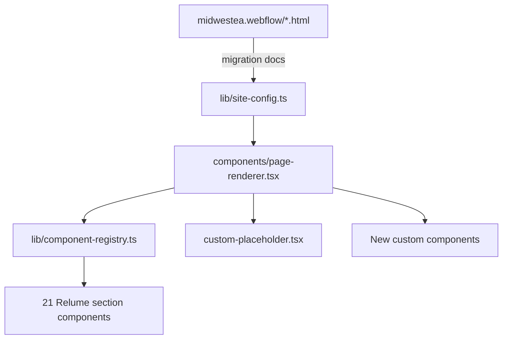

# Webflow → Next.js Migration Guide

This folder contains **51 page-by-page migration specs** — one markdown file per HTML file in [`midwestea.webflow/`](../../midwestea.webflow/). Each doc maps Webflow sections to React/Relume components, lists verbatim content to port, and flags custom components to build.

**Implement migrations one page at a time.** Use the doc as the source of truth; audit in the browser against the Webflow export before moving on.

**Run a migration in chat:**

```
/migrate-midwest <page-name>
```

Example: `/migrate-midwest about` — uses the project skill at `.cursor/skills/migrate-midwest/SKILL.md`.

---

## Architecture



### Current app state

| Item | Location | Notes |
|------|----------|-------|
| Page composition | [`lib/site-config.ts`](../../lib/site-config.ts) | Defines route + ordered sections |
| Component registry | [`lib/component-registry.ts`](../../lib/component-registry.ts) | 21 Relume sections |
| Renderer | [`components/page-renderer.tsx`](../../components/page-renderer.tsx) | Spreads `section.props` to registered components |
| Content modules | [`lib/pages/`](../../lib/pages/) | Per-page verbatim props (see `basic-life-support-content.ts`) |
| Global layout | [`app/layout.tsx`](../../app/layout.tsx) | Navigation + Footer, Midwest fonts & tokens |

### Target URL convention

**Flat slugs** matching Webflow filenames:

- `basic-life-support.html` → `/basic-life-support`
- `emergency-medical-responder.html` → `/emergency-medical-responder`
- `purchase-confirmation/bls.html` → `/purchase-confirmation/bls`

---

## Standard migration doc structure

Every page doc follows this format:

1. **Source & target** — Webflow path, Next.js route, reference template
2. **Page metadata** — verbatim `<head>` tags
3. **Global chrome** — nav/footer (layout-level, not PageRenderer sections)
4. **Section map** — table: Webflow class → component → action
5. **Section content** — verbatim headings, paragraphs, FAQs, tabs, links, images
6. **Assets** — image paths as they appear in HTML
7. **Interactions / JS** — GSAP, Swiper, Stripe, inline scripts
8. **Implementation checklist**
9. **Dependencies / blockers**

### Action values

| Action | Meaning |
|--------|---------|
| `use-existing` | Component exists; default styling OK |
| `update-content` | Component exists; pass page-specific props from Webflow text |
| `update-styling` | Component exists; adjust Tailwind/classes to match Webflow |
| `build-custom` | No Relume equivalent — build new component from Webflow HTML |
| `extend-component` | Extend existing component (e.g. Header 64 with cross-ref links) |
| `skip-chrome` | Nav/footer/global styles — goes in root layout |

---

## Webflow section → Relume component mapping

| Webflow class / block | Relume / app component | Component file |
|----------------------|------------------------|----------------|
| `section_image-scale-header` | Header 108 | `components/header-108.tsx` |
| `section_layout137` | Layout 137 | `components/layout-137.tsx` |
| `section_layout1` | Layout 1 | `components/layout-1.tsx` |
| `section_layout228` | Layout 228 | `components/layout-228.tsx` |
| `section_stats33` | Stats 33 | `components/stats-33.tsx` |
| `section_team2` | Team 2 | `components/team-2.tsx` |
| `section_testimonial3` | Testimonial 3 | `components/testimonial-3.tsx` |
| `section_faq` | FAQ 6 | `components/faq-6.tsx` |
| `section_cta36` | CTA 36 | `components/cta-36.tsx` |
| `content-hero` + `header64_component` | Header 64 | `components/header-64.tsx` |
| `section_content7` | Content 7 | `components/content-7.tsx` |
| `section_hero-header` | Header 60 | `components/header-60.tsx` |
| `section_class-grid` | Product 1 | `components/product-1.tsx` |
| `section_testimonial-small` | Testimonial 1 | `components/testimonial-1.tsx` |
| `section_course-header` | Product Header 6 | `components/product-header-6.tsx` |
| `section_gallery22` | Gallery 22 | `components/gallery-22.tsx` |
| `section_who-its-for` | Layout 423 | `components/layout-423.tsx` |
| `section_layout493` | Layout 493 | `components/layout-493.tsx` |
| `section_faqs` (simple, course/program detail) | FAQ 6 | `components/faq-6.tsx` |
| `section-feature-grid` | Layout 520 | `components/layout-520.tsx` |
| `section_layout349` | Layout 349 | `components/layout-349.tsx` |
| `section_layout54` | Layout 54 | `components/layout-54.tsx` |
| `policy-hero` | Header 64 (extended) | `components/header-64.tsx` |
| `section_policy-content` | Content 7 (extended) | `components/content-7.tsx` |

### Custom sections — must be built (no Relume equivalent)

| Webflow class / block | Used on | Planned component |
|----------------------|---------|-------------------|
| `section_home-hero` | `index.html` | `components/home-hero.tsx` |
| `section-programs` / `mission-section` | `index.html` | `components/home-programs.tsx` |
| `section_ways-to-learn` | `index.html` | `components/ways-to-learn.tsx` |
| `section_testimonial` (home variant) | `index.html` | `components/home-testimonial.tsx` |
| `section_trainers` | `index.html`, 6 program pages | `components/trainers.tsx` |
| `section-courses-home` | `index.html` | `components/courses-home.tsx` |
| `hero-track` + `hero-video` | 6 program detail pages | `components/program-hero.tsx` |
| `program-ui` | program detail + `programs.html` | `components/enrollment-bar.tsx` |
| `section-program-hero` | `programs.html` | `components/program-gallery-hero.tsx` |
| `programs-scroller` / `program-panel` | `programs.html` | `components/programs-scroller.tsx` |
| `section_faqs.hero` | `faq.html`, `contact.html`, `policies.html` | `components/faq-hero.tsx` |
| `contact_component` | `contact.html` | `components/contact-section.tsx` |
| `checkout-section` | `checkout/details.html` | `components/checkout-details.tsx` |
| `utility_component` | `404.html`, `401.html` | `components/utility-page.tsx` |
| `navigation.navigation-component` | all content pages | `components/navigation.tsx` |
| `footer.footer_component` | all content pages | `components/footer.tsx` |

---

## Template ↔ Webflow reference map

| Webflow source | Reference template | Production route |
|---------------|-------------------|------------------|
| [`index.md`](index.md) | **NEW** | `/` |
| [`about.md`](about.md) | `/about` | `/about` |
| [`programs.md`](programs.md) | `/program-gallery` | `/programs` |
| [`courses.md`](courses.md) | `/course-gallery` | `/courses` |
| [`faq.md`](faq.md) | `/faq` | `/faq` |
| [`contact.md`](contact.md) | `/contact` | `/contact` |
| [`policies.md`](policies.md) | `/policies-list` | `/policies` |
| [`detail_policies.md`](detail_policies.md) | `/policy` | `/policies/[slug]` |
| [`terms-of-service.md`](terms-of-service.md) | `/terms-of-service` | `/terms-of-service` |
| [`privacy-policy.md`](privacy-policy.md) | `/terms-of-service` pattern | `/privacy-policy` |
| 6 program detail pages | `/program-template` | flat slugs |
| 12 course detail pages | `/course-template` | flat slugs |
| 18 `purchase-confirmation/*` | `/order-confirmation` | `/purchase-confirmation/{slug}` |
| [`how-it-works/programs.md`](how-it-works/programs.md) | partial Layout 493 | `/how-it-works/programs` |
| [`how-it-works/couress.md`](how-it-works/couress.md) | partial Layout 493 | `/how-it-works/couress` |
| [`checkout/details.md`](checkout/details.md) | **NEW** | `/checkout/details` |
| [`404.md`](404.md), [`401.md`](401.md) | **NEW** | utility routes |
| [`navbar.md`](navbar.md), [`style-guide.md`](style-guide.md), [`untitled.md`](untitled.md) | N/A | extract into shared components |

---

## Required `site-config.ts` template fixes

These gaps exist in the current reference templates and must be fixed during migration:

### 1. `/program-template` — missing Trainers section

Webflow program detail pages include `section_trainers` **between** Layout 54 and Layout 493. Current config:

```typescript
// lib/site-config.ts — current (incomplete)
{ type: "component", component: "Layout 54" },
{ type: "component", component: "Layout 493" },  // ← trainers missing here
```

**Fix:** Insert `{ type: "custom", label: "Trainers" }` (or registered Trainers component) after Layout 54.

**Exception:** [`emergency-medical-technician.md`](emergency-medical-technician.md) omits both Layout 54 and uses trainers before Layout 493.

### 2. `/faq`, `/contact`, `/policies-list` — wrong component

Current config uses bare `FAQ 6`. Webflow uses `section_faqs.hero` — a 2-column layout with left sidebar (nav links, contact info, or policy list) and right FAQ/content column.

**Fix:**
- `/faq` → FaqHero component with grouped FAQ sections
- `/contact` → ContactSection component (contact info left + FAQ accordions right)
- `/policies-list` → FaqHero variant with policy CMS list

### 3. `/privacy-policy` — route missing

Webflow has `privacy-policy.html`. App has `/terms-of-service` but no `/privacy-policy`. Add route using same Header 64 + Content 7 pattern.

### 4. Content props — implemented

`ComponentSection` supports optional `props`; `PageRenderer` spreads them to registered components. Per-page content lives in `lib/pages/<slug>-content.ts`. See [`lib/pages/README.md`](../../lib/pages/README.md).

```typescript
export type ComponentSection = {
  type: "component";
  component: ComponentKey;
  props?: Record<string, unknown>;
};

// PageRenderer
return <Component {...(section.props ?? {})} />;
```

---

## Infrastructure prerequisites (Phase 0)

| # | Item | Status |
|---|------|--------|
| 1 | `props` on `ComponentSection` | Done |
| 2 | `PageRenderer` spreads props | Done |
| 3 | Global layout (Navigation + Footer) | Done — [`components/navigation.tsx`](../../components/navigation.tsx), [`components/footer.tsx`](../../components/footer.tsx) |
| 4 | Fonts & design tokens | Done — [`lib/fonts.ts`](../../lib/fonts.ts), [`tailwind.config.ts`](../../tailwind.config.ts), [`app/globals.css`](../../app/globals.css) |
| 5 | Static assets in `public/` | Done — images, fonts, videos copied from Webflow export |
| 6 | Template config fixes | Done — trainers, FaqHero/ContactSection placeholders, `/privacy-policy` |
| 7 | JS porting map | Done — [`INTERACTIONS.md`](INTERACTIONS.md) |

Register custom section components in `component-registry.ts` as they are built during page migrations.

---

## Recommended execution order

| Phase | Doc(s) | Rationale |
|-------|--------|-----------|
| 0 | This README + infrastructure | Unblocks all pages |
| 1 | [`about.md`](about.md) | Best 1:1 template match |
| 2 | [`terms-of-service.md`](terms-of-service.md), [`privacy-policy.md`](privacy-policy.md) | Simple Header 64 + Content 7 |
| 3 | [`basic-life-support.md`](basic-life-support.md) | Reference course; batch remaining 11 courses |
| 4 | [`emergency-medical-responder.md`](emergency-medical-responder.md) | Reference program; batch remaining 5 programs |
| 5 | [`courses.md`](courses.md), [`programs.md`](programs.md) | Gallery pages with custom scroll |
| 6 | [`faq.md`](faq.md), [`contact.md`](contact.md), [`policies.md`](policies.md), [`detail_policies.md`](detail_policies.md) | Custom FAQ hero layouts |
| 7 | [`index.md`](index.md) | Most custom sections |
| 8 | `how-it-works/*`, `purchase-confirmation/*` | Variants of existing patterns |
| 9 | [`checkout/details.md`](checkout/details.md), [`404.md`](404.md), [`401.md`](401.md) | Utility |
| 10 | [`navbar.md`](navbar.md), [`style-guide.md`](style-guide.md), [`untitled.md`](untitled.md) | Shared components/tokens |

---

## Course detail template (shared by 12 pages)

All course pages follow this section order. See [`basic-life-support.md`](basic-life-support.md) for full verbatim content; other course docs list page-specific deltas.

| # | Webflow class | Component |
|---|--------------|-----------|
| 1 | `section_course-header` | Product Header 6 |
| 2 | `section_gallery22` | Gallery 22 |
| 3 | `section_who-its-for` | Layout 423 |
| 4 | `section_layout493` | Layout 493 |
| 5 | `section_testimonial-small` | Testimonial 1 |
| 6 | `section_faqs` | FAQ 6 |

**Course pages:** `basic-life-support`, `advanced-cardiovascular-life-support`, `pediatric-advanced-life-support`, `cpr-first-aid`, `pediatric-first-aid-cpr-aed`, `child-and-babysitting-safety`, `active-shooter-training`, `bloodborne-pathogens`, `emergency-use-of-medical-oxygen`, `use-and-administration-of-epinephrine-auto-injectors`

---

## Program detail template (shared by 6 pages)

| # | Webflow class | Component | Notes |
|---|--------------|-----------|-------|
| 1 | `hero-track` + `program-ui` | ProgramHero + EnrollmentBar | Custom |
| 2 | `section-feature-grid` | Layout 520 | |
| 3 | `section_layout349` | Layout 349 | |
| 4 | `section_layout54` | Layout 54 | **Omitted on EMT only** |
| 5 | `section_trainers` | Trainers | **Missing from site-config** |
| 6 | `section_layout493` | Layout 493 | |
| 7 | `section_faqs` | FAQ 6 | |

**Program pages:** `emergency-medical-responder`, `emergency-medical-technician`, `paramedic`, `community-paramedic`, `critical-care-transport`, `advanced-tactical-casualty-care`

---

## Purchase confirmation template (shared by 18 pages)

| # | Webflow class | Component |
|---|--------------|-----------|
| 1 | `content-hero` + `header64_component` | Header 64 (Confirmation variant) |

See [`purchase-confirmation/general.md`](purchase-confirmation/general.md). Other confirmation pages share structure; page title/meta differs per course/program.

---

## CMS / dynamic content notes

The Webflow export contains empty CMS placeholders (`w-dyn-bind-empty`, `w-dyn-list`). Static visible content is extracted into each doc. Fields requiring a data source at implementation:

- **Trainers list** — `trainers_component w-dyn-items`
- **Course grid** on `courses.html` — `section_class-grid w-dyn-list`
- **Policies list** on `policies.html` — `.policy-item w-dyn-list`
- **Policy detail** — title, body, cross-references, adoption date
- **Course pricing** — Stripe URLs are static in HTML; price amounts may be CMS-bound

---

## Regenerating docs

Migration docs were generated from Webflow HTML via:

```bash
npm run migration:docs
# or: node scripts/generate-migration-docs.mjs
```

See also [`DOC-TEMPLATE.md`](DOC-TEMPLATE.md) for the standard per-page doc structure.

Re-run after Webflow re-export to refresh verbatim content.

---

## All migration doc files (51)

### Root (28)
`index`, `about`, `programs`, `courses`, `faq`, `contact`, `policies`, `detail_policies`, `terms-of-service`, `privacy-policy`, `404`, `401`, `navbar`, `style-guide`, `untitled`, plus 6 program and 12 course pages.

### Subdirectories (23)
- `how-it-works/programs`, `how-it-works/couress`
- `checkout/details`
- `purchase-confirmation/` — general, acls, atcc, avert, babysitting, bls, bloodborne, cct, cp, cpr, emr, emt, epinephrine, oxygen, pals, paramedic, pediatric-cpr
